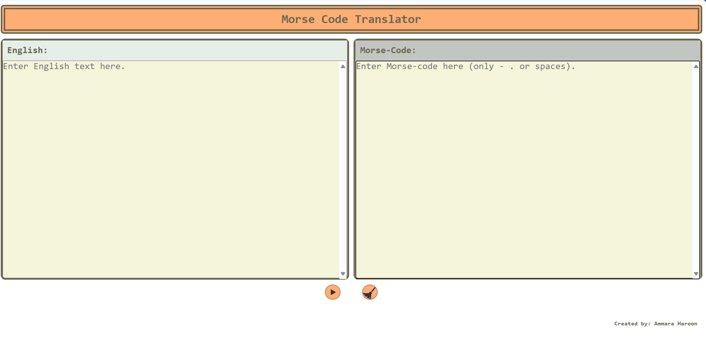

# morse-code-translator

Morse Code Translator in Vanilla JavaScript, SASS and HTML

## Project Description

The goal of this project is to create a web page Morse Code translator.

## Project Requirements

- A user interface that allows the user to either input some English text or some Morse Code
- Javascript functions to translate English to Morse Code and Morse Code into English text
- Handle spaces properly
- Test cases for the functions

## Design:

The morse code translator has two text areas in which user can input english text and morse code sequence respectively. The page has two buttons. One is for clearing the text areas and the other is for translating english to morse code sound. Input text and translation are simultaneously matched. Whenever a text changes, translation appears on the other side. The errors in input are red and correct text is colored green. The color on the tab of the text area hints at what mode of translation i.e. english or morse code is active.

### Screenshots:

### Tools Used:

- HTML
- SCSS
- JavaScript

### Code Structure:

HTML, SCSS, compiled CSS, JavaScript and Image files (assets) are maintained in separate folders.

### Implementation Details

- The DOM functionality is separate from the translator logic.
- The text areas show color coded text as it is masked by a div that copies the text entered by the user and adds red and green color to the text through styling.
- The translation area is updated live as the user types text. This is achieved by using "input" event listener on the text areas.
- In morse code text area only spaces, dots and dashes can be typed. All other keys are disabled through keypress event listener and preventDefault method to stop typing
- Delete, backspace and arrow keys are allowed as they help the user in text editing.
- Play button plays the sound and clear button removes text from text areas via "click" event listener.
- Each character is translated through an object called translator that contains another object characterMap containing all the key value pairs from english characters to morse code.
- Each time user enters a character it is checked against this object and added to the translation. If the code or character does not exist #undecodable# is added to the translation in its spot.
  -A similar object contains the reverse key value pairing.
- Special checks are put in place to check for spaces and it is made sure that no extra spaces are added while translation.
- The extra spaces in the morse code are corrected on the go. Only a single and a group of 7 spaces are kept. The rest are considered erronous and removed from the user's input.
